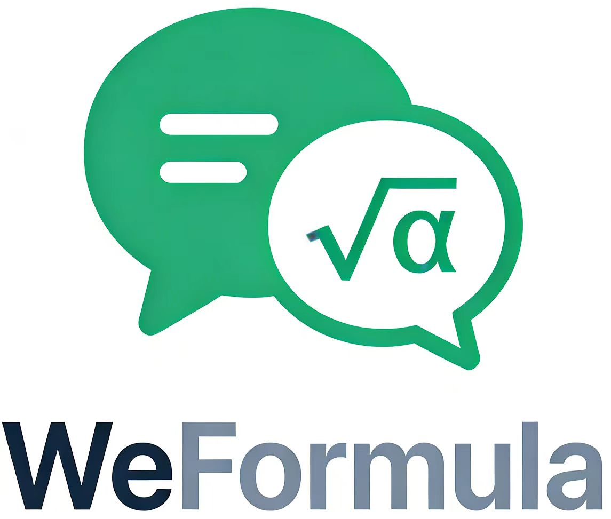
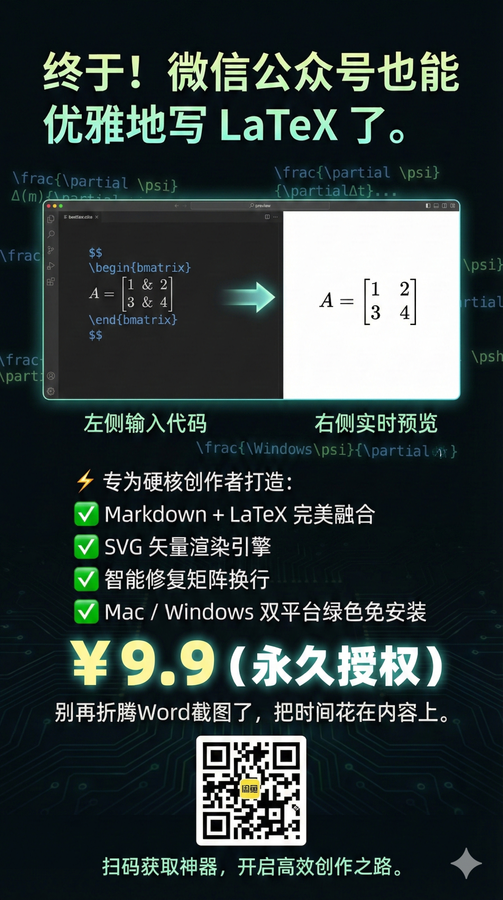
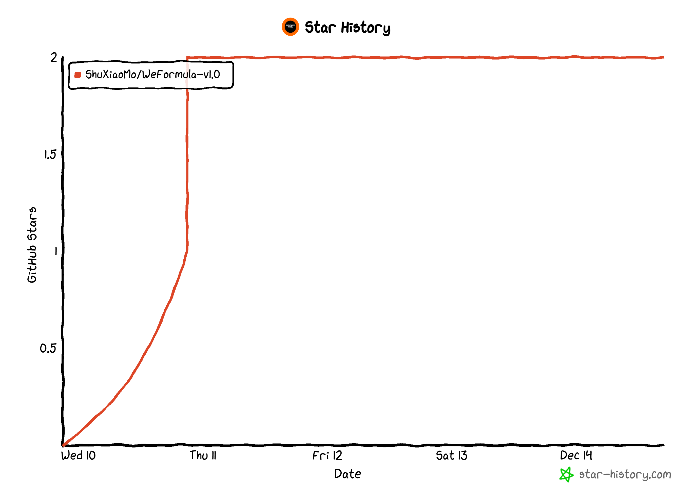

#   WeFormula-v1.0

)

**WeFormula-v1.0** 官方仓库。

## 📰 动态

*   **[2025-12-14]** **WeFormula-v1.0** 购买链接正式发布！  
*   **[2025-12-10]** **WeFormula-v1.0** 仓库创建！

---

## 🎥 演示视频

​	敬请期待……

---

## 📖 简介

​	作为 STEM 博主，每次推文最痛苦的就是对付公式：微信内置编辑器不认 LaTeX，截图发糊，第三方插件又总爱崩版。有时就为了放个简单的 $E=mc^2$，就能折腾半小时。  
​	于是早年文章里全是 PNG：先写 LaTeX，再截图，再粘贴。  

​	把市面上工具试了个遍，发现规律永远一致：好用的贵，便宜的卡，部署还麻烦。既然都不趁手，干脆自己造——微信公式样式器（SVG 独立版）——**WeFormula-v1.0** 就此诞生。

---

## 🛠️ 快速上手

​	购买后即可一键启用！

---

## ⭐ Star 趋势

